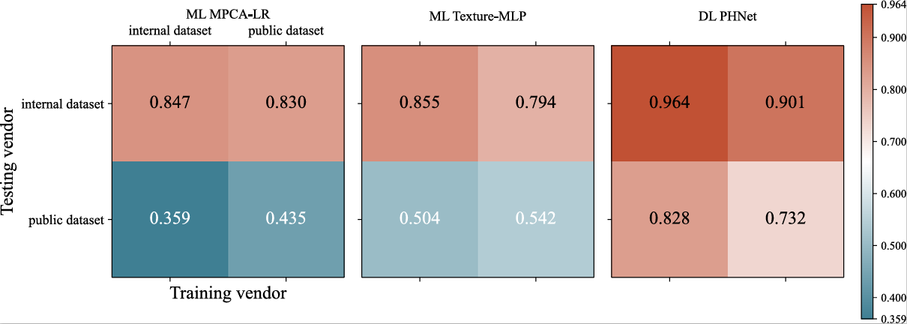
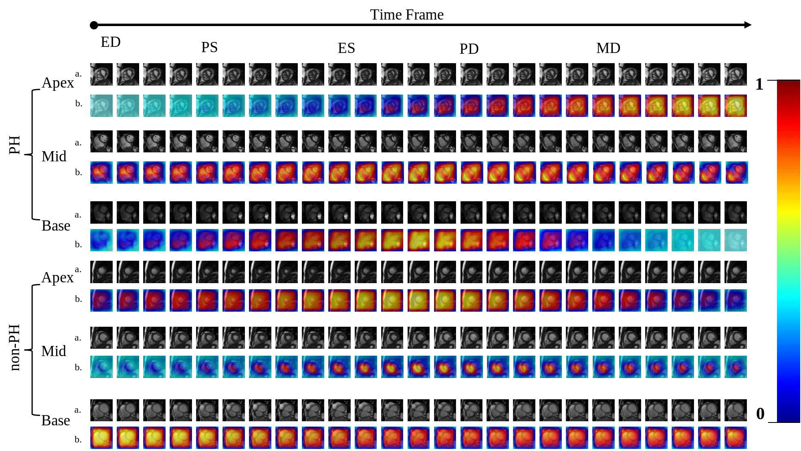
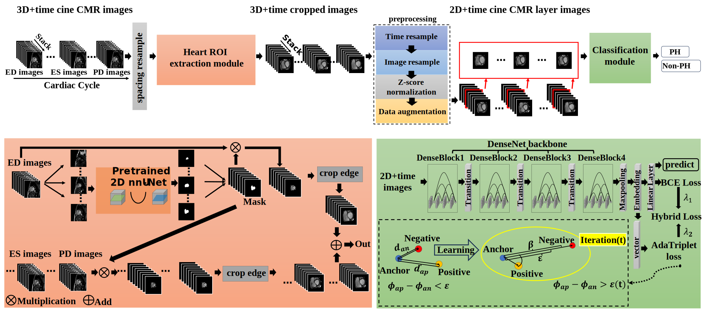

# PHNet: A pulmonary hypertension detection network based on cine cardiac magnetic resonance images using a hybrid strategy of adaptive triplet and binary cross-entropy losses

<!-- PROJECT SHIELDS -->

[![Contributors][contributors-shield]][contributors-url]
[![Forks][forks-shield]][forks-url]
[![Stargazers][stars-shield]][stars-url]
[![Issues][issues-shield]][issues-url]
[![MIT License][license-shield]][license-url]
[![LinkedIn][linkedin-shield]][linkedin-url]

**Description**

Pulmonary hypertension (PH) is a fatal pulmonary vascular disease. The standard diagnosis of PH heavily relies on an invasive technique, i.e., right heart catheterization, which leads to a delay in diagnosis and serious consequences. Noninvasive approaches are crucial for detecting PH as early as possible; however, it remains a challenge, especially in detecting mild PH patients. To address this issue, we present a new fully automated framework, hereinafter referred to as PHNet, for noninvasively detecting PH patients, especially improving the detection accuracy of mild PH patients, based on cine cardiac magnetic resonance (CMR) images. The PHNet framework employs a hybrid strategy of adaptive triplet and binary cross-entropy losses (HSATBCL) to enhance discriminative feature learning for classifying PH and non-PH. Triplet pairs in HSATBCL are created using a semi-hard negative mining strategy which maintains the stability of the training process. Experiments show that the detection error rate of PHNet for mild PH is reduced by 24.5% on average compared to state-of-the-art PH detection models. The hybrid strategy can effectively improve the model's ability to detect PH, making PHNet achieve an average area under the curve (AUC) of 0.964, an accuracy of 0.912, and an F1-score of 0.884 in the internal validation dataset. In the external testing dataset, PHNet achieves an average AUC value of 0.828. Thus, PHNet has great potential for noninvasively detecting PH based on cine CMR images in clinical practice. Future research could explore more clinical information and refine feature extraction to further enhance the network performance. The dataset can be found at [GY-PH-dataset](https://github.com/Oulu-IMEDS/AdaTriplet)

<p align="center">
  <a href="https://github.com/gy-xinchen/PHNet/">
    
  </a>

</p>

<p align="center">
  <a href="https://github.com/gy-xinchen/PHNet/">
    
  </a>

</p>

<p align="center">
  <a href="https://github.com/gy-xinchen/PHNet/">
    
  </a>

</p>

## PHNet in PyTorch
We provide PyTorch implementations for PHNet.
The code was inspired by [AdaTriplet](https://github.com/Oulu-IMEDS/AdaTriplet) and modified by [xinchen yuan](https://github.com/gy-xinchen).

**Note**: The current software works well with PyTorch 1.4.0+.

The 2D nnU-Net was a older nnU-Net created by [FabianIsensee](https://github.com/MIC-DKFZ/nnUNet/tree/nnunetv1), it was used to biventricular segmentation with the 2017 Automated Cardiac Diagnosis Challenge(ACDC) dataset pre-trained weight from cine CMR images.

The following PHNet was created by [xinchen yuan](https://github.com/gy-xinchen), it contains a biventricular segmentation module and DenseNet based Classification module.

<p align="center">
  <a href="https://github.com/gy-xinchen/PHNet/">
    
  </a>

</p>

## Prerequisites
- Linux or Windows (Pycharm + Anaconda)
- Python 3
- CPU or NVIDIA GPU + CUDA CuDNN

## Getting Started
-You can install all the dependencies by
```bash
pip install -r requirements.txt
```
- Clone this repo:
```bash
git clone https://github.com/gy-xinchen/PHNet
cd PHNet
```
- For Anaconda users, you can use pip to install PyTorch and other libraries.

## [Datasets]
create a directory below and add your own datasets.

choosed slice cine CMR images have same size of 25x224x224.
```
Random_cine_CMR_Data：
|─train
│      patient000.nii.gz 
│      patient001.nii.gz
│      patient002.nii.gz
│      ...
│
├─internal_val
│      patient000.nii.gz 
│      patient001.nii.gz
│      patient002.nii.gz
│      ...
│
├─external_test
│      patient000.nii.gz 
│      patient001.nii.gz
│      patient002.nii.gz
│      ...
│
└─train_data.csv
└─val_data.csv
```

<!-- links -->
[your-project-path]:gy-xinchen/PHNet
[contributors-shield]: https://img.shields.io/github/contributors/gy-xinchen/PHNet.svg?style=flat-square
[contributors-url]: https://github.com/gy-xinchen/PHNet/graphs/contributors
[forks-shield]: https://img.shields.io/github/forks/gy-xinchen/PHNet.svg?style=flat-square
[forks-url]: https://github.com/gy-xinchen/PHNet/network/members
[stars-shield]: https://img.shields.io/github/stars/gy-xinchen/PHNet.svg?style=flat-square
[stars-url]: https://github.com/gy-xinchen/PHNet/stargazers
[issues-shield]: https://img.shields.io/github/issues/gy-xinchen/PHNet.svg?style=flat-square
[issues-url]: https://img.shields.io/github/issues/gy-xinchen/PHNet.svg
[license-shield]: https://img.shields.io/github/license/shaojintian/Best_README_template.svg?style=flat-square
[license-url]: https://github.com/gy-xinchen/PHNet/blob/master/LICENSE.txt
[linkedin-shield]: https://img.shields.io/badge/-LinkedIn-black.svg?style=flat-square&logo=linkedin&colorB=555
[linkedin-url]: https://linkedin.com/in/gy-xinchen
